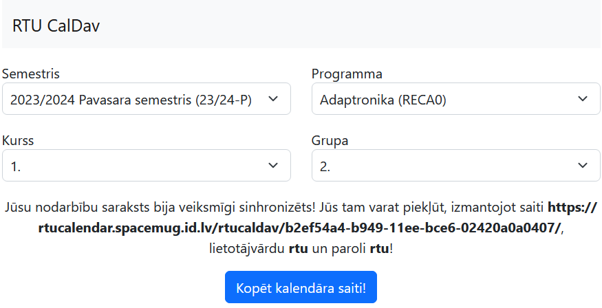
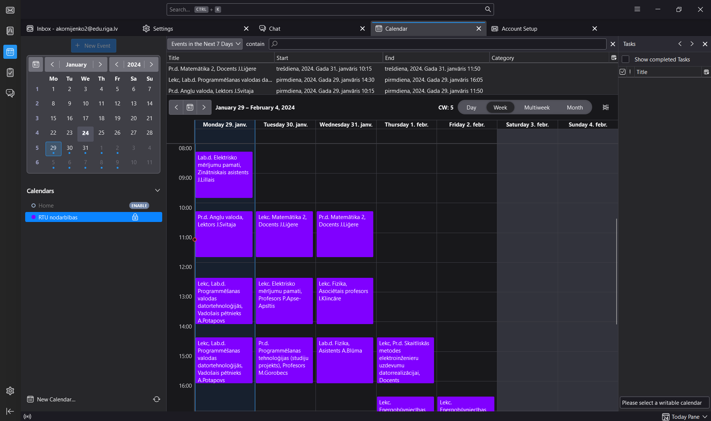
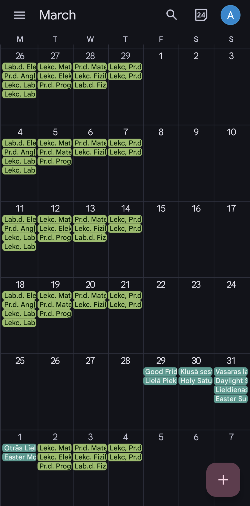

# RTU CalDav

[`RTU CalDav`](https://rtucaldav.spacemug.id.lv) is an application, that translates `nodarbibas.rtu.lv` publicated timetables into
`CalDav` calendars, allowing anyone to add a `RTU` timetable into calendar on most modern platforms.
Timetables are synced two times a day.

Official application version is available at [rtucaldav.spacemug.id.lv](https://rtucaldav.spacemug.id.lv).

## Screenshots

RTU CalDav web app

Calendar imported in `Mozilla Thunderbird`

Calendar imported in `Goodle Calendar`, using <code>DAVx5</code>

## Development environment setup

1. Clone the repository
2. Navigate to the repository's root directory in terminal (in the next steps it would be considered, that you are using `PowerShell`)
3. Create a Python virtual environment (`python -m venv venv`)
4. Activate a Python virtual environment (`./venv/Scripts/Activate.ps1`)
5. Install required libraries for `RTU CalDav` (`python -m pip install -r requirements.txt`)
6. Install `Radicale` `CalDav` server (`python -m pip install radicale`)
7. Create a `RTU CalDav` database (`python manage.py migrate`)
8. Create a superuser in `RTU CalDav` (`python manage.py createsuperuser`)
9. Start a `RTU CalDav` development server (`python manage.py runserver`)
10. In a separate terminal window start a `Radicale` `CalDav` server with development config (`python -m radicale --config utilities/radicale-config-dev`)

## Deploying as a `Docker` container

Application can be deployed as a `Docker` container.

`Docker` image runs a `RTU CalDav` application and `Radicale` `CalDav` server behind `Apache`.

It is considered that a `Docker` container runs behind a reverse-proxy, the reverse-proxy forwards requests from to different domains (for `RTU CalDav` and `Radicale` domains should be separate) to the appropriate exposed container network ports.

All the data is stored in `/opt/data`. Consider making it persistant.

Container ports that should be exposed:
- `80` - `RTU CalDav` application
- `5232` - `Radicale` `CalDav` server

There are several environment variables that might be changed:
- `HOST` a hostname of `RTU CalDav` application (default - `127.0.0.1`)
- `CSRF_ORIGIN` a `CSRF` trusted origin (default - `http://127.0.0.1`)
- `CALDAV_PUBLIC_URL` a `URL` prefix that is used for public `CalDav` server when a calendar link is given to the user (default - `http://127.0.0.1:5232`)
- `DJANGO_SUPERUSER_USERNAME` - `RTU CalDav` application admin username (default - `admin`)
- `DJANGO_SUPERUSER_PASSWORD` - `RTU CalDav` application admin password (default - `admin`)
- `DJANGO_SUPERUSER_EMAIL` - `RTU CalDav` application admin email (default - `aabbcc@example.com`)

### Building and running container in command line

1. Clone the repository
2. Navigate to the repository's root directory in terminal 
3. Build a `Docker` image (`docker build -t rtucaldav .`)
4. Run a `Docker` container (`docker run -p 80:80 -p 5232:5232 rtucaldav`)

### Building and running container using `Docker Compose`

1. Clone the repository
2. Navigate to the repository's root directory in terminal 
3. Copy `docker-compose.yaml` file to the parent directory
4. Navigate to parent directory
5. Change `docker-compose.yaml` according to your needs
6. Build a `Docker image` (`docker compose build`)
7. Run a `Docker Compose` as a daemon (`docker compose up -d`)
